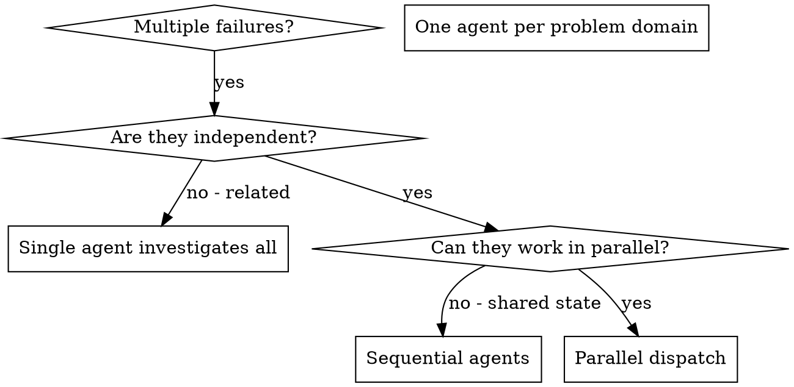

# Dispatching Parallel Agents

## Overview

You delegate tasks to specialized agents with isolated context. By precisely crafting their instructions and context, you ensure they stay focused and succeed at their task. They should never inherit your session's context or history — you construct exactly what they need. This also preserves your own context for coordination work.

When you have multiple unrelated failures (different test files, different subsystems, different bugs), investigating them sequentially wastes time. Each investigation is independent and can happen in parallel.

**Core principle:** Dispatch one agent per independent problem domain. Let them work concurrently.

## When to Use



**Use when:**
- 3+ test files failing with different root causes
- Multiple subsystems broken independently
- Each problem can be understood without context from others
- No shared state between investigations

**Don't use when:**
- Failures are related (fix one might fix others)
- Need to understand full system state
- Agents would interfere with each other

## The Pattern

### 1. Identify Independent Domains

Group failures by what's broken:
- File A tests: Tool approval flow
- File B tests: Batch completion behavior
- File C tests: Abort functionality

Each domain is independent - fixing tool approval doesn't affect abort tests.

### 2. Create Focused Agent Tasks

Each task in the `delegate_task` array gets:
- **goal**: Clear statement of what to accomplish
- **context**: Complete prompt with:
  - Specific scope: One test file or subsystem
  - Clear goal: What success looks like
  - Constraints: What NOT to change
  - Expected output: What should the agent return?
- **toolsets**: Required tools (["file", "terminal"] is typical)

### 3. Dispatch in Parallel

Use `delegate_task` with a `tasks` array to dispatch independent agents concurrently:

**Task object structure:**
- `goal`: Clear description of what the agent should accomplish
- `context`: All information needed (error messages, file paths, constraints, expected output)
- `toolsets`: Which toolsets the agent needs (e.g., ["file", "terminal"])

```python
# Dispatch three agents in parallel
delegate_task(tasks=[
    {
        "goal": "Fix agent-tool-abort.test.ts failures",
        "context": "3 failing tests related to tool abort functionality:\n1. \"should abort tool with partial output capture\" - expects 'interrupted at' in message\n2. \"should handle mixed completed and aborted tools\" - fast tool aborted instead of completed\n3. \"should properly track pendingToolCount\" - expects 3 results but gets 0\n\nThese are timing/race condition issues. Replace arbitrary timeouts with event-based waiting. Find the real issue - do NOT just increase timeouts.\n\nReturn: Summary of what you found and what you fixed.",
        "toolsets": ["file", "terminal"]
    },
    {
        "goal": "Fix batch-completion-behavior.test.ts failures",
        "context": "2 failing tests related to batch tool completion:\n- Tools not executing properly\n- Event structure issues\n\nIdentify root cause and fix. Focus on event structure and completion handling.\n\nReturn: Summary of root cause and changes made.",
        "toolsets": ["file", "terminal"]
    },
    {
        "goal": "Fix tool-approval-race-conditions.test.ts failures",
        "context": "1 failing test where execution count = 0 when should be > 0\n\nThis is a race condition in tool approval flow. Ensure async tool execution completes before assertions.\n\nReturn: Summary of what you found and what you fixed.",
        "toolsets": ["file", "terminal"]
    }
])
# All three agents run concurrently
```

**Safety check before parallelizing:**
- Do tasks modify the same file? → Sequential dispatch instead
- Does one task's context reference another task's output? → Sequential
- Are files in separate directories/modules? → Parallel OK
- Are investigations independent (no shared fixtures or state)? → Parallel OK

When in doubt: sequential dispatch is always safe. Parallel is an optimization when independence is clear.

### 4. Review and Integrate

When agents return:
- Read each summary
- Verify fixes don't conflict
- Run full test suite
- Integrate all changes

## Crafting the Context Field

The `context` field contains the complete prompt for the agent. Good prompts are:

1. **Focused** - One clear problem domain
2. **Self-contained** - All context needed to understand the problem
3. **Specific about output** - What should the agent return?

```markdown
Fix the 3 failing tests in src/agents/agent-tool-abort.test.ts:

1. "should abort tool with partial output capture" - expects 'interrupted at' in message
2. "should handle mixed completed and aborted tools" - fast tool aborted instead of completed
3. "should properly track pendingToolCount" - expects 3 results but gets 0

These are timing/race condition issues. Your task:

1. Read the test file and understand what each test verifies
2. Identify root cause - timing issues or actual bugs?
3. Fix by:
   - Replacing arbitrary timeouts with event-based waiting
   - Fixing bugs in abort implementation if found
   - Adjusting test expectations if testing changed behavior

Do NOT just increase timeouts - find the real issue.

Return: Summary of what you found and what you fixed.
```

## Common Mistakes

**❌ Too broad:** "Fix all the tests" - agent gets lost
**✅ Specific:** "Fix agent-tool-abort.test.ts" - focused scope

**❌ No context:** "Fix the race condition" - agent doesn't know where
**✅ Context:** Paste the error messages and test names

**❌ No constraints:** Agent might refactor everything
**✅ Constraints:** "Do NOT change production code" or "Fix tests only"

**❌ Vague output:** "Fix it" - you don't know what changed
**✅ Specific:** "Return summary of root cause and changes"

## When NOT to Use

**Related failures:** Fixing one might fix others - investigate together first
**Need full context:** Understanding requires seeing entire system
**Exploratory debugging:** You don't know what's broken yet
**Shared state:** Agents would interfere (editing same files, using same resources)

## Real Example from Session

**Scenario:** 6 test failures across 3 files after major refactoring

**Failures:**
- agent-tool-abort.test.ts: 3 failures (timing issues)
- batch-completion-behavior.test.ts: 2 failures (tools not executing)
- tool-approval-race-conditions.test.ts: 1 failure (execution count = 0)

**Decision:** Independent domains - abort logic separate from batch completion separate from race conditions

**Dispatch:**
```python
delegate_task(tasks=[
    {
        "goal": "Fix agent-tool-abort.test.ts failures",
        "context": "3 failing tests with timing/race condition issues. Replace arbitrary timeouts with event-based waiting. Return summary of root cause and changes.",
        "toolsets": ["file", "terminal"]
    },
    {
        "goal": "Fix batch-completion-behavior.test.ts failures",
        "context": "2 failing tests - tools not executing properly. Fix event structure bug. Return summary of changes.",
        "toolsets": ["file", "terminal"]
    },
    {
        "goal": "Fix tool-approval-race-conditions.test.ts failures",
        "context": "1 failing test where execution count = 0. Add wait for async tool execution. Return summary of changes.",
        "toolsets": ["file", "terminal"]
    }
])
```

**Results:**
- Agent 1: Replaced timeouts with event-based waiting
- Agent 2: Fixed event structure bug (threadId in wrong place)
- Agent 3: Added wait for async tool execution to complete

**Integration:** All fixes independent, no conflicts, full suite green

**Time saved:** 3 problems solved in parallel vs sequentially

## Key Benefits

1. **Parallelization** - Multiple investigations happen simultaneously
2. **Focus** - Each agent has narrow scope, less context to track
3. **Independence** - Agents don't interfere with each other
4. **Speed** - 3 problems solved in time of 1

## Verification

After agents return:
1. **Review each summary** - Understand what changed
2. **Check for conflicts** - Did agents edit same code?
3. **Run full suite** - Verify all fixes work together
4. **Spot check** - Agents can make systematic errors

## Real-World Impact

From debugging session (2025-10-03):
- 6 failures across 3 files
- 3 agents dispatched in parallel
- All investigations completed concurrently
- All fixes integrated successfully
- Zero conflicts between agent changes
